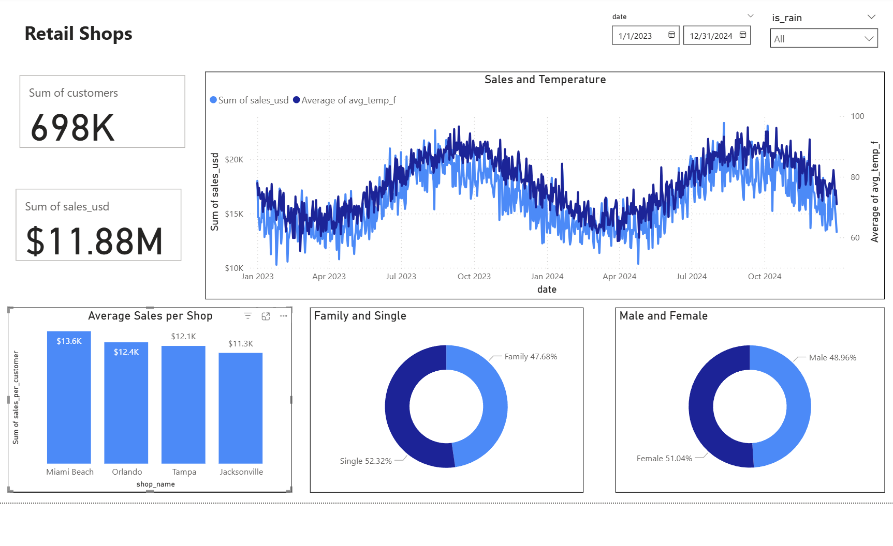

# Retail Case Study
This Retail Case Study explores a two-year dataset of Florida retail shops to uncover how weather, location, and customer demographics shape sales performance. Leveraging PowerBI and MySQL, the dashboard is dynamic and interactive, with visualizations that show the direct impact of things like weather and customer demographics and how they impact performance. 

## Dataset Overview
Dataset contains valuable information that could help us optimize our operations, boost sales, and provide insights on how to organize future planning, staffing, and promotions. A few key data fields across three tables:
- Weather: Date, average temperature, precipitation in inches, whether or not it was raining
- Customer Survey: Date, percentage male, percentage female, percentage single, percentage family
- Sales: Date, shop name, number of customers, sales in USD.

## Analysis Objectives
1. **Link sales data with weaather patterns and survey demographics**:

2. **Identify correlations: Temperature vs sales, rainfall effects**: 

3. **Compare shop performance and seasonal patterns**: 

## Key Questions Explored

1. How strongly do temperate and rainfall affect daily sales?
2. Which shop performs the best, and why?
3. Who are our customers - families vs singles, male vs female - and how does this change over time?
4. Are there predictable seasonal patterns in sales?

## Summary of Findings
Sales are shaped by weather, location, and customer mix. For maximum growth, operations must adapt to seasonsal shifts and customer patterns. 
- Higher staff and stock on hot summer days
- Run rainy-day discounts to keep traffic steady
- Build loyalty in Jacksonville
- Target families on weekends and singles on weekdays
